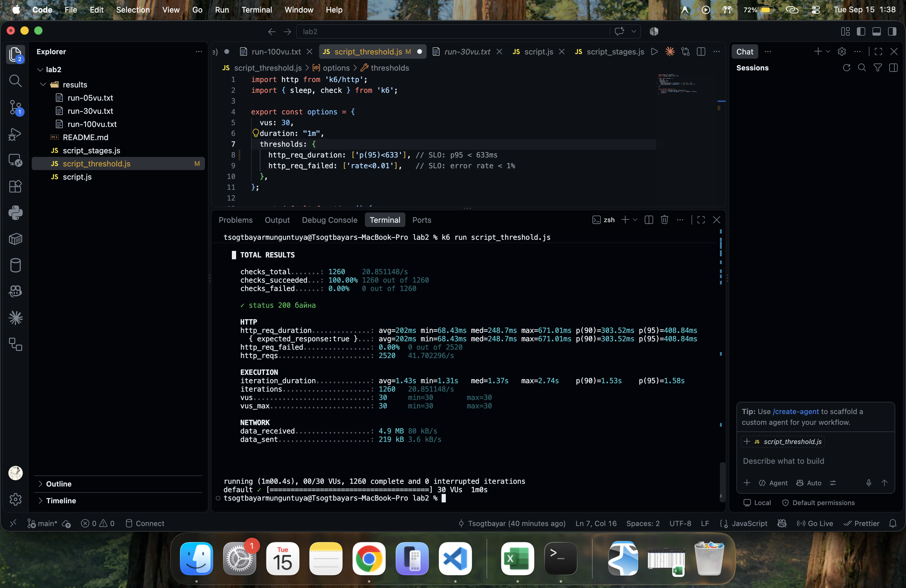
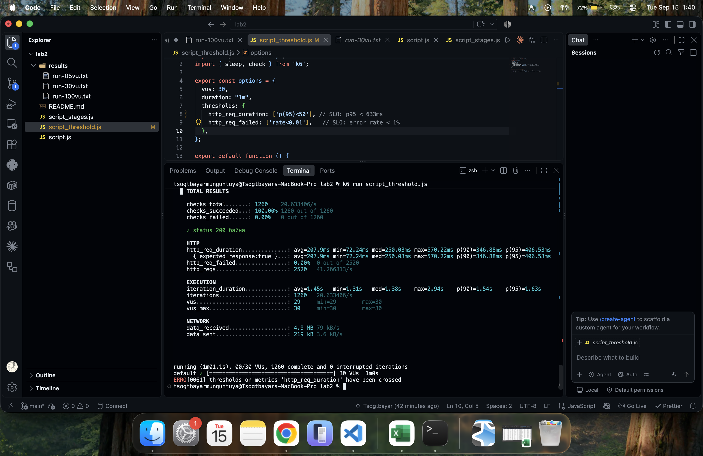
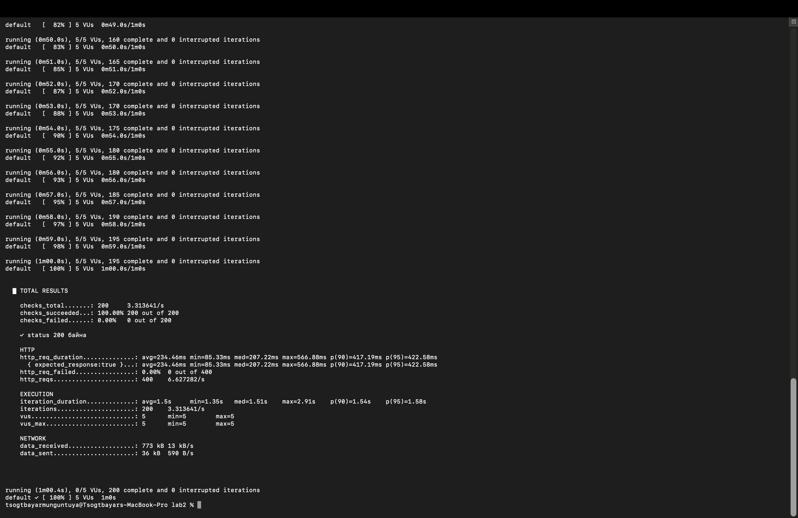
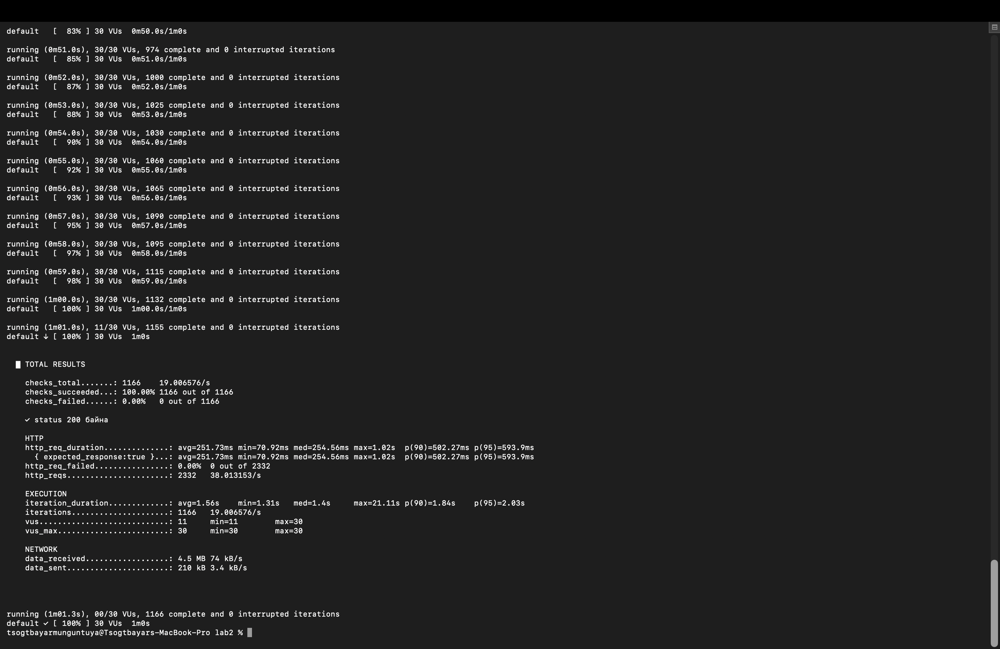
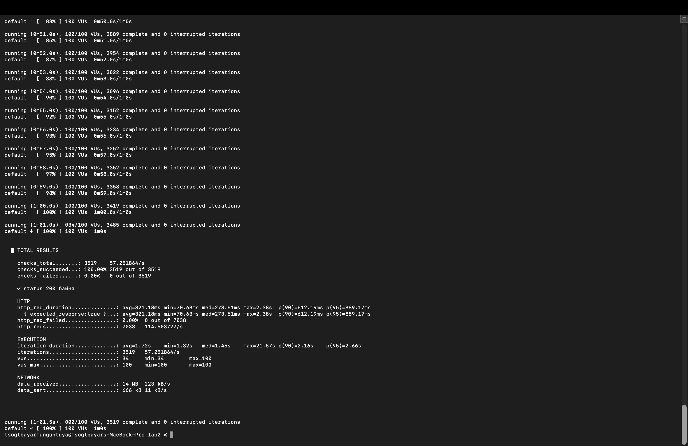

# Лаборатори №2: Гүйцэтгэлийн хэмжүүрийг k6-аар хэмжих

- **Оюутны нэр:** М.Цогтбаяр
- **Оюутны код:** B242270133
- **k6 version:** `k6 v2.2.0 (commit/devel, go1.26.5, darwin/arm64)`

## 1. 3 түвшний харьцуулсан хүснэгт

| VU (Хэрэглэгч) |  p90 (ms)   |  p95 (ms)  | Throughput (reqs/s) | Error Rate (%)|
|----------------|-------------|------------|---------------------|---------------| 
| 5 VU           | 417.19      | 422.58     | 6.627282            | 0.00          |
| 30 VU          | 502.27      | 593.9      | 38.013153           | 0.00          |
| 100 VU         | 612.19      | 889.17     | 114.503727          | 0.00          |


## 2. SLO (Threshold) сонгосон тайлбар

**Миний сонгосон SLO:** `p(95) < 633ms`

**Яагаад энэ утгыг сонгосон бэ?** 
Миний 5 VU дээрх хэмжилтийн p95 (baseline) утга 422.58ms гарсан. Тиймээс системд ачаалал нэмэгдэх үед ч хэвийн ажиллагааг хангахын тулд энэхүү baseline утгыг ойролцоогоор 1.5 дахин үржүүлж, хариу өгөх хугацаа нь 633ms-ээс хэтрэхгүй байх ёстой гэж үзэн SLO-гоо (`p(95)<633`) тохируулсан болно.

**Threshold-ийн бодит үр дүн:**

`run-threshold-pass.txt` нэртэй файлд `p(95)<633` зорилтот threshold тавьсан боловч туршилтын бодит үр дүнд `p(95)=2.41s` гарч, threshold **FAIL** болсон. Иймээс энэ файлыг PASS үр дүн гэж тайлбарлаагүй. Сүлжээний latency өндөр байсан тул 633ms-ийн SLO хангагдаагүй; `http_req_failed` харин `0.00%` хэвээр байна. `run-threshold-fail.txt` нь зориудаар хатуу `p(95)<50` threshold ашигласан тул `p(95)=2.74s` гарч мөн FAIL болсон.

**Threshold-ийн дэлгэцийн зургууд:**
<br>

<br>


**VU түвшин бүрийн туршилтын дэлгэцийн зургууд:**

| 5 VU | 30 VU | 100 VU |
|---|---|---|
|  |  |  |

**Туршилтын бүрэн гаралтууд:**

- [5 VU гаралт](results/run-05vu.txt)
- [30 VU гаралт](results/run-30vu.txt)
- [100 VU гаралт](results/run-100vu.txt)
- [Threshold PASS гаралт](results/run-threshold-pass.txt)
- [Threshold FAIL гаралт](results/run-threshold-fail.txt)
- [Stages гаралт](results/stages.txt)

## 3. Stages-ийн үр дүн ба SLO-ийн дүгнэлт

Stages туршилтаар нийт **3,036 хүсэлт** боловсруулж, `p(95)=4.96s` (`4960ms`) гарсан. Энэ нь `633ms`-ийн SLO-оос ойролцоогоор **7.83 дахин их** тул stages туршилт мөн SLO-г хангаагүй. Харин HTTP error rate `0.00%` байсан.

Гаралтын файлуудыг бүхэлд нь хадгалахдаа stderr-ийн `ERRO` мөрүүдийг орхигдуулахгүй байлгахын тулд дараах хэлбэрийг ашигласан:

```bash
k6 run script_threshold_pass.js 2>&1 | tee results/run-threshold-pass.txt
k6 run script_threshold_fail.js 2>&1 | tee results/run-threshold-fail.txt
k6 run script_stages.js 2>&1 | tee results/stages.txt
```

## 4. Дүгнэлт

Энэхүү лабораторийн ажлаар k6 хэрэгслийг ашиглан веб серверийн гүйцэтгэлийг бодитоор хэмжиж, ачаалал хэрхэн нөлөөлдгийг туршлаа. Ачааллыг 5 VU-ээс 30 VU болон 100 VU болгон шатлан өсгөхөд хариу өгөх хугацаа буюу p90, p95 (latency) утгууд дагаад өссөн. Stages туршилтын `p(95)=4.96s` нь сонгосон `633ms` SLO-оос өндөр байсан тул системийн latency шаардлага хангагдаагүй, гэхдээ error rate `0.00%` байлаа. Threshold-ийн туршилт нь зөвхөн нэрээр нь PASS гэж дүгнэхгүй, k6-ийн бодит threshold үр дүнг унших ёстойг харуулсан. Цаашид SLO-г хангахын тулд серверийн latency болон сүлжээний нөхцөлийг сайжруулж, локал сервер дээр дахин хэмжилт хийх шаардлагатай.
